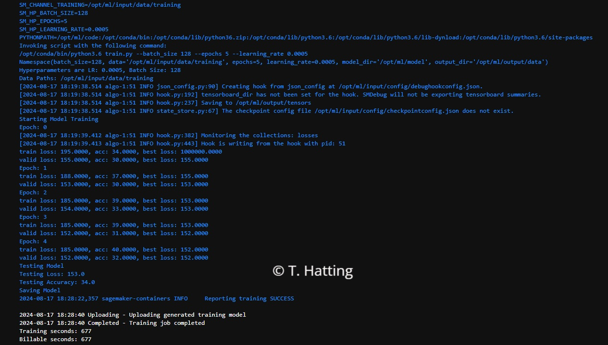

# Inventory Monitoring at Distribution Centers
AWS SageMaker has been leveraged to fine-tune a pre-trained model for the task of counting items in bins at a distribution center. Images of bins are captured by robots while moving shelf units around the warehouse floor. This project is designed to simulate a typical workflow that a machine learning engineer would undertake.

&nbsp;

## Project Set Up and Installation
Log onto the AWS platform. Open SageMaker Studio and clone this GitHub repository. Following files are needed to run the project:

1) sagemaker.ipynb             (jupyter notebook)
2) train.py                    (script for model training including debugging and profiling)
3) hpo.py                      (script for hyperparameter optimization)
4) inference.py                (script for deployment)
5) 00100.jpg and 00371.jpg     (random images from test directory in S3)

Open the jupyter notebook 'sagemaker.ipynp' and execute the code section by section. The jupyter notebook uses the script files: train.py, hpo.py and inference.py. Also, a couple of test images have been included.

&nbsp;

## Dataset

### Overview
The project will use the Amazon Bin Image Dataset. This dataset is publicly available and contains 500,000 images of bins. Each bin contains one or more items. The bin images are captured while the robots move shelf units around the distribution center. This forms part of the normal operations in an Amazon Fulfillment Center. Information about the dataset can be found [*here*](https://registry.opendata.aws/amazon-bin-imagery/).

Below are sample pictures from the dataset:  

### Access
To reduce training cost and duration, a subset of the Amazon Bin Image Dataset has been used (approximately 2% of the full dataset). This is done by means of the AWS CLI in notebook 'sagemaker.ipynb'. The data has then been divided into 3 folders in Amazon S3: train, valid and test. The correct policies have been added to the execution role of SageMaker to ensure SageMaker can access S3 to carry out the training.

Note: the subset was split in the following way: training (90%), validation (5%) and testing (5%). The data split was done manually in Amazon S3 by calculating how many files should be in each
directory and then deleting any unwanted files. This could also have been done by means of an algorithm. However, it was not possible to create an effective algorithm for this during the project.  

&nbsp;

## Model Training
In this project, the ResNet model has been used. It is a well-known convolutional neural network (CNN) and is widely used for image classification. Furthermore, transfer learning has been used. This means that only the last layer has been trained, and the rest of the model parameters are frozen. During training 3 hyperparameters have been tuned: learning rate, batch size and epochs. These are common hyperparameters set during model training.

Learning rate - determines the step size in each iteration when moving toward a minimum for the loss 

Batch size - number of images which are processed together before the model parameters are updated

Epoch - one complete pass of the entire training dataset

Two versions of the ResNet model have been compared, resnet50 and resnet101, where the number refers to the depth in terms of layers of the neural network. More information about PyTorch's implementation of ResNet can be found [*here*](https://pytorch.org/vision/main/models/resnet.html).

In the training session, suitable values have been picked for the hyperparemeters:

learning_rate = 0.0005

batch_size = 128

epochs = 5

Below is a screenshot of a training session with resnet50:

Below is a screenshot of a training session with resnet101:

The test accuracy of resnet101 (34%) is slightly higher compared to resnet50 (29%). This is likely due to the fact that resnet101 has a deeper architecture. In the sections below, training will be carried out with resnet101. Furthermore, hyperparameter tuning will be used to achieve an even higher test accuracy.

&nbsp;

## Machine Learning Pipeline
In general, a machine learning pipeline consists of following steps:

1. Data collection
2. Data Preprocessing
3. Training
4. Evaluation
5. Deployment
6. Monitoring

In this project, a subset of the dataset has been downloaded from the source (registry of open data on AWS) and uploaded to Amazon S3. This subset has been split into training, validation and testing. The images have been resized and randomly flipped horizontally. The training has involved several iterative steps, including tuning of the hyperparameters. During training, the model has been evaluated using the evaluation dataset. After the training, the model has been evaluated using the test dataset, which is untouched i.e. has not been used during training. After satisfactory evaluation, the trained model has then been deployed. The deployment consisted of creating a SageMaker endpoint that can be queried by the user. In terms of monitoring, debugging and profiling have been used.  

&nbsp;

## Hyperparameter Tuning
In terms of models, resnet101 has been used for the hyperparameter tuning. The hyperparameters have been tuned with following ranges:

learning_rate: (0.00001 to 0.01)

batch_size: (32, 64, 128, 256)

epochs: (10 to 20)

The ranges have been chosen taking into account aspects such as accuracy, cost, duration and instance size. During the tuning, two different training runs were generated in parallel. Metrics were logged during the tuning process. During tuning, the **test accuracy** has been used as the target metric with the objective of maximizing this value.

The tuning lead to following "best" hyperparameter values (these will vary somewhat from tuning session to tuning session):

learning_rate : 0.00021

batch_size: 256

epochs: 13

See screenshot for hyperparameter tuning:

&nbsp;

## Debugging and Profiling
Configuration of the SageMaker debugger consists of following steps:

1) Import Amazon SageMaker debugger                    (notebook sagemaker.ipynb)
2) Add hooks to train and test model                   (script train.py)
3) Create hook and register model                      (script train.py)
4) Configure debugger rules and pass to estimator      (notebook sagemaker.ipynb)

Configuring the Sagemaker profiler is similar to the debugger: create profiler rules and configs,
pass profiler configuration to estimator and configure hook in the training script.

### Results
Below is a screenshot for training using the hyperparameters obtained from the tuning and including debugging/profiling:

As can be seen, the test accuracy is 57%, which is higher than the previous run. There seems to be some overfitting, as the training and validation accuracy are quite far
apart. The overfitting could be due to the dataset being too small.  Also, note that spot instances have been used to reduce the training costs.

Below is a screenshot of CPU/GPU utilization obtained from the profiling. To speed up the training, the model and dataloaders in PyTorch have been offloaded to the GPU (CUDA) in the EC2 instance. This shows up clearly in the graph. 

&nbsp;

## Model Deployment
A *predictor* (endpoint) is created using the deploy() method on a Pytorch instance of the model. An test image (.jpg file) is then passed to the endpoint, in this case an image of a bin. A response is generated using *predictor.predict()*. The response returns a vector of probabilities. The index with the highest positive value indicates the correct label. In this case, the index is 1 (indexing starts at zero). In the bin image dataset stored in S3, index 1 corresponds to folder 2/ i.e. bin images with two objects. Therefore, the inference result is correct!   

Screenshot for inference using sample bin image in the test directory:

&nbsp;

## Cost Analysis
At the time or writing, the on-demand price of instance-type g4dn.xlarge was 0.526 (dollars) per hour whereas the spot price of the same instance-type was 0.1559 (dollars) per hour (note: this assumes that the instances are set up with Linux and not Windows). In conclusion, spot instances provide a significant saving. To use spot instances, set parameters 'use_spot_instances', 'max_run' and 'max_wait' when creating the estimator.  See notebook 'sagemaker.ipynb' for the corresponding code.

&nbsp;

## Multi-Instance Training
To use multi-instance training is relatively easy in SageMaker compared to other systems. It is done by setting the parameter 'instance_count' to the desired number instances when creating the estimator. SageMaker then figures out how to do the rest. See notebook 'sagemaker.ipynb' for the corresponding code. The main reason for using multiple instances is to speed up the training. However, in this project, the training is relatively fast with just one EC2 instance. There seems to be no major benefit to using multiple instances. This is because the training dataset is relatively small (only 2% of the full dataset available). Also, the training has been speeded up by offloading to the GPU (CUDA). It is also possible to have multi-instance training with distributed data i.e. the data is sharded (split) between multiple instances. However, again as the dataset is relatively small, it does not seem to be beneficial to use sharded data.

